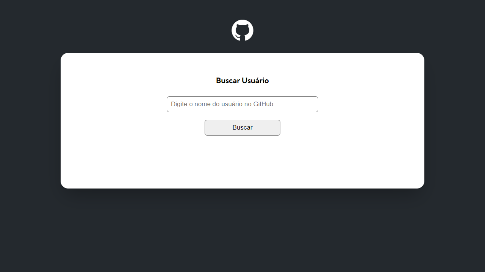

<h1 align="center">
  GitHub API - Buscando Usuários com Fetch <br/> ⚔️ Quest JavaScript Avançado ⚔️
</h1>
<p align="center">
  Projeto de <a href="https://jonathanbenedito.github.io/projeto-fetch-github-api/" target="_blank">website</a> feito para a uma quest do curso <a href="https://www.linkedin.com/school/devquest-dev-em-dobro/">DevQuest - Dev em Dobro</a>, trata-se de um web app que busca algum usuário no GitHub.
</p>




## 💬 Sobre

### Geral

O projeto permite procurar um usuário que esteja cadastrado no GitHub, mostrando algumas informações sobre:

-   Nome
-   Login
-   Bio
-   Foto de perfil
-   Eventos
-   Repositórios
-   Número de seguidores
-   Número de pessoas que o usuário está seguindo

### O Desafio

O desafio consistia em adicionar 3 funcionalidades no projeto já desenvolvido pelo curso:

1. Mostrar número de seguidores e a quantidade de pessoas que o usuário está seguindo.

2. Apresentar uma lista de no máximo 10 últimos eventos do usuário no GitHub, que sejam apenas do tipo "CreateEvent" e "PushEvent".

3. Mostrar a quantidade de forks, estrelas, watchers e a linguagem de programação do repositório.

## 🛠 Guia de instalação

1. Faça o clone do projeto
    ```
    git clone https://github.com/jonathanBenedito/projeto-fetch-github-api.git
    ```

2. Acesse o repositório
    ```
    cd projeto-fetch-github-api
    ```

### 🔗 Links

Website: <a href="https://jonathanbenedito.github.io/projeto-fetch-github-api/" target="_blank">jonathanbenedito.github.io/projeto-fetch-github-api</a>

DevQuest - Dev em Dobro (Linkedin): <a href="https://www.linkedin.com/school/devquest-dev-em-dobro/" target="_blank">linkedin.com/school/devquest-dev-em-dobro/</a>

### 🧱 Tecnologias

O website foi construído usando HTML 5, CSS 3 e Javascript.

<div style="display: flex; margin-top: 15px; gap: 20px;">
  
  
          
</div>